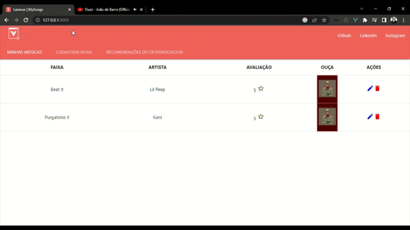

Semelhante aos projetos anteriores que, resumidamente, um crud com VueJS (consumindo API Rest feita com Laravel). A diferença é que, desta vez, temos uma interface específica para criação e edição de dados. Podemos observar os métodos para o redirecionamento a esta nova tela em "resources > js > views > edit.vue/table.vue", além de incluir uma nova rota em "resources > js > routers > router.js".

    

